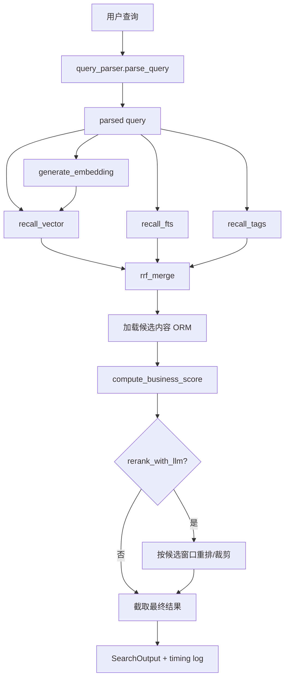
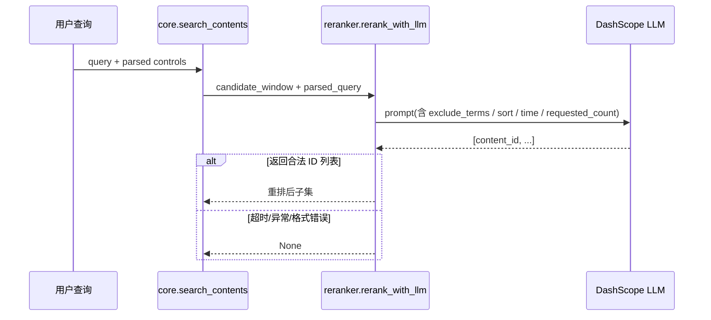

# PromoFlow 搜索召回系统

本文档从**当前实现**出发，客观描述 PromoFlow 搜索召回系统的结构、执行流程、配置项、已知边界与测试覆盖。本文不记录本次整理过程，也不包含尚未落地的设计设想。

## 系统范围

当前搜索系统同时服务两个调用入口：

- Web 端 `POST /api/v1/search`
- 飞书 Bot 消息检索与问答

二者共用统一服务入口：`backend/app/services/search/core.py` 中的 `search_contents()`。

## 模块与职责

搜索相关代码位于 `backend/app/services/search/`：

- `core.py`：统一编排入口；负责串联解析、召回、融合、打分、重排与日志
- `query_parser.py`：查询理解；规则解析为主，可选 LLM 补充结构化词项
- `retriever.py`：多路召回；包含 vector / FTS / tag + AI keyword 三条召回路径
- `ranker.py`：RRF 融合与业务加权打分
- `reranker.py`：LLM rerank；负责对候选窗口进行精排与可选裁剪
- `document_builder.py`：构建 `search_document` 与 `embedding_text`
- `dictionaries/`：类型词、停用词、同义词词典

外围调用点：

- `backend/app/routers/search.py`：HTTP 搜索接口
- `backend/app/bot/handlers.py`：Bot 搜索入口；在统一召回结果之上再做 RAG 回答与素材投递

## 总体数据流

## 处理阶段说明

### Query 理解

`parse_query()` 先执行规则解析，再按条件决定是否调用 LLM。

规则解析当前负责识别：

- 内容类型：如 `视频`、`图片`
- 返回数量：如 `给我3个`、`给我两个`
- 排序意图：如 `最新`、`热门`
- 时间窗口：如 `最近一个月`、`近7天`
- 排除条件：如 `不要图片`
- 基础关键词：基于简化分词和停用词过滤
- 同义词扩展：补充 `should_terms`

LLM 解析的职责是补充结构化词项；**数量、时间窗口、排除词等控制意图仍以规则层结果为准**。如果 LLM 返回了更好的 `must_terms` / `should_terms`，则会替换词项集合，但不会覆盖这些控制型约束。

### Embedding 生成

`search_contents()` 会针对 `parsed.query_embedding_text` 生成一次 embedding，供向量召回使用。

### 并发召回

当前共有三条召回路径：

1. **向量召回**：基于 pgvector cosine distance
2. **FTS 召回**：
   - `SEARCH_FTS_BACKEND=zhparser` 时走 PostgreSQL 全文检索
   - 发生配置缺失时回退到 `ILIKE`
   - `SEARCH_FTS_BACKEND=ilike` 时直接使用 `ILIKE`
3. **标签 / AI 关键词召回**：
   - 人工标签精确 / 短语命中
   - AI 关键词精确 / 短语命中

三条路径通过 `asyncio.gather()` 并发执行，但**每条路径都使用独立的 `AsyncSession`**。该设计用于避免并发共享同一个 session 时触发 asyncpg 的并发访问冲突。

### 多阶段约束生效位置

| 约束/信号 | Query 解析 | Recall 层 | 业务打分 | LLM rerank |
| --- | --- | --- | --- | --- |
| `parsed_content_type` | 提取 | 是，三路召回均可过滤 | 是 | 是 |
| `must_terms` | 提取 | 是，FTS/tag 直接使用 | 是 | 是 |
| `should_terms` | 扩展/补充 | 是，FTS/tag 直接使用 | 间接影响 | 是 |
| `sort_intent` | 提取 | 否 | 是 | 是 |
| `time_intent` | 提取 | 否 | 是 | 是 |
| `limit_intent` | 提取 | 否 | 否 | 作为上下文输入 |
| `exclude_terms` | 提取 | **否** | 否 | **是** |

`exclude_terms` 当前只参与 query 解析与 rerank prompt，不在三路召回阶段做硬过滤。因此它当前更接近一种**后置精排约束**，而不是召回层的硬性筛选条件。

### RRF 融合

召回结果通过 `rrf_merge()` 进行 Reciprocal Rank Fusion，得到统一候选集与基础融合分。RRF 负责将不同召回路径的排序结果合并，避免某单一路径完全主导候选集。

### 业务打分

对融合后的候选内容，`compute_business_score()` 会叠加以下信号：

- 内容类型命中
- 标签精确 / 短语命中
- AI 关键词精确 / 短语命中
- 标题命中
- 类目命中
- `must_terms` 在描述 / 摘要中的命中
- FTS 归一化分
- 向量相似度归一化分
- 新鲜度加分
- 热门排序附加分（当 `sort_intent == hot`）
- 时间窗口命中 / 失配处理（当存在 `time_intent`）

额外规则：

- 若 `must_terms` 完全未命中，会显著降权
- RRF 分数会按固定比例叠加到最终分数中

### LLM rerank

`rerank_with_llm()` 只有在以下条件同时满足时才执行：

- `SEARCH_ENABLE_LLM_RERANK=true`
- `parsed.need_llm_rerank == true`

当前实现中，rerank 处理对象是**候选窗口**，大小由 `SEARCH_LLM_RERANK_CANDIDATE_LIMIT` 控制。

LLM rerank 的行为特征：

- 输入包含原始 query、排序意图、时间意图、`exclude_terms`、期望数量以及候选素材摘要
- 输出必须是一个按最终顺序排列的内容 ID 数组
- 可以只返回候选窗口中的一个子集
- 未被返回的候选会被视为**显式剔除**，系统不会再把尾部结果补回去

## 输出与可观测性

服务返回 `SearchOutput`：

- `results`
- `timing`（仅当 `SEARCH_DEBUG_TIMING=true` 时对外返回）
- `query_info`

无论 `SEARCH_DEBUG_TIMING` 是否开启，`core.py` 都会通过 `_log_timing()` 输出结构化 timing 日志，记录：

- query parse
- embedding
- vector / fts / tag recall
- rrf merge
- scoring
- llm rerank
- 候选数与最终结果数

因此，`SEARCH_DEBUG_TIMING` 控制的是**API 响应是否携带 timing 字段**，而不是是否写 timing 日志。

## 搜索文档构建

`document_builder.py` 负责两个文本：

- `build_search_document()`：供 FTS 使用
- `build_embedding_text()`：供 embedding 使用

字段顺序按业务权重组织，优先覆盖：

- 标题
- 人工标签
- AI 关键词
- 类目
- 内容类型中文标签
- 描述
- AI 摘要

当 AI 失败时，可使用 `build_embedding_text_fallback()` 构造降级 embedding 文本。

## 调用侧职责边界

### Web

Web 端负责：

- 接收搜索参数
- 调用 `search_contents()`
- 将领域输出映射为 schema

### Bot

Bot 负责：

- 调用 `search_contents()` 获取统一候选结果
- 将候选结果组织为 RAG 上下文
- 调用回答生成能力
- 根据聊天类型投递素材文件

因此，Web 与 Bot 共享同一套检索与排序逻辑，Bot 只是在检索之后多了一层回答生成与素材投递。

## 配置项

搜索相关配置集中在 `backend/app/core/config.py`。

### Query 解析

- `SEARCH_ENABLE_LLM_QUERY_PARSE`
- `SEARCH_LLM_QUERY_PARSE_MODEL`
- `SEARCH_LLM_QUERY_PARSE_TIMEOUT_S`

### Recall

- `SEARCH_VECTOR_RECALL_LIMIT`
- `SEARCH_FTS_RECALL_LIMIT`
- `SEARCH_TAG_RECALL_LIMIT`
- `SEARCH_RRF_K`
- `SEARCH_FTS_BACKEND`
- `SEARCH_FTS_ZH_TSCONFIG`

### 业务打分

- `SEARCH_SCORE_CONTENT_TYPE_MATCH`
- `SEARCH_SCORE_TAG_EXACT`
- `SEARCH_SCORE_TAG_PHRASE`
- `SEARCH_SCORE_AI_KEYWORD_EXACT`
- `SEARCH_SCORE_AI_KEYWORD_PHRASE`
- `SEARCH_SCORE_TITLE_EXACT`
- `SEARCH_SCORE_TITLE_PHRASE`
- `SEARCH_SCORE_CATEGORY_EXACT`
- `SEARCH_SCORE_CATEGORY_PHRASE`
- `SEARCH_SCORE_MUST_TERM_DESC`
- `SEARCH_SCORE_MUST_TERM_SUMMARY`
- `SEARCH_SCORE_FTS_MAX`
- `SEARCH_SCORE_VECTOR_MAX`
- `SEARCH_SCORE_FRESHNESS_MAX`
- `SEARCH_SCORE_HOT_MAX`
- `SEARCH_SCORE_HOT_MULTIPLIER`

### Rerank

- `SEARCH_ENABLE_LLM_RERANK`
- `SEARCH_LLM_RERANK_MODEL`
- `SEARCH_LLM_RERANK_CANDIDATE_LIMIT`
- `SEARCH_LLM_RERANK_TIMEOUT_S`

### Observability

- `SEARCH_DEBUG_TIMING`

## 当前已知边界与取舍

- `exclude_terms` 当前不在 recall 层做硬过滤；最终结果质量依赖 rerank 对显式排除条件的拦截
- 这意味着召回阶段仍可能带回与排除条件相关的候选，但这些候选可在后续排序阶段被降级或剔除
- 将 `exclude_terms` 下沉到三路召回意味着要分别处理向量召回、FTS 召回和 tag / keyword 召回中的一致性语义，实施复杂度和误杀风险都更高
- FTS 是否真正使用 `zhparser` 取决于部署环境中是否安装并配置了对应的 PostgreSQL text search config；缺失时系统会降级到 `ILIKE`
- LLM query parse 与 LLM rerank 都具备超时 / 异常降级能力；失败时会回落到纯规则解析或原始初排结果

## 测试覆盖

搜索相关测试按职责拆分在 `backend/tests/` 下的多个文件中：

- `test_search_api.py`：HTTP 搜索接口返回与向量排序表现
- `test_search_query_parser.py`：规则解析、LLM 词项覆盖与控制意图保留
- `test_search_retriever.py`：FTS 降级、backend 分发与 tag recall 批量查询
- `test_search_ranker.py`：热门 / 最新排序附加分与时间窗口处理
- `test_search_core.py`：timing 日志、query limit 与 rerank 子集行为
- `test_search_errors.py`：搜索错误映射行为

当前覆盖重点包括：

- 搜索接口返回结果
- 向量相似度对排序的影响
- FTS 在缺失 zhparser 配置时自动降级到 `ILIKE`
- FTS backend 分发逻辑
- Query 解析中的数量、时间、排序、排除词提取
- LLM 解析结果对词项的覆盖，以及规则控制意图的保留
- 标签召回批量查询逻辑
- 热门 / 最新排序加权
- timing 结构化日志输出
- query limit 仅作用于最终输出，不截断召回与 rerank 候选池
- LLM rerank 返回子集时不重新补回尾部候选
